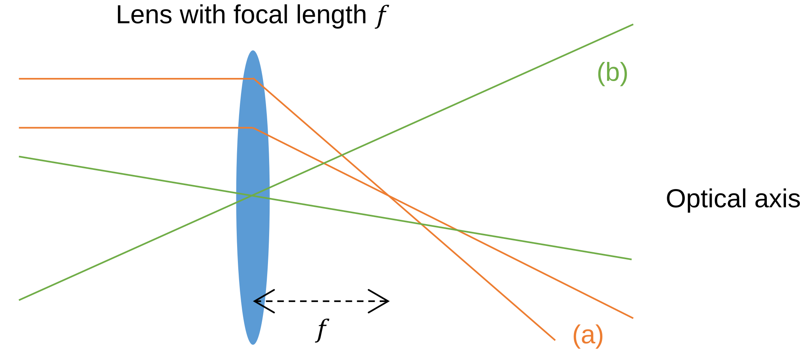
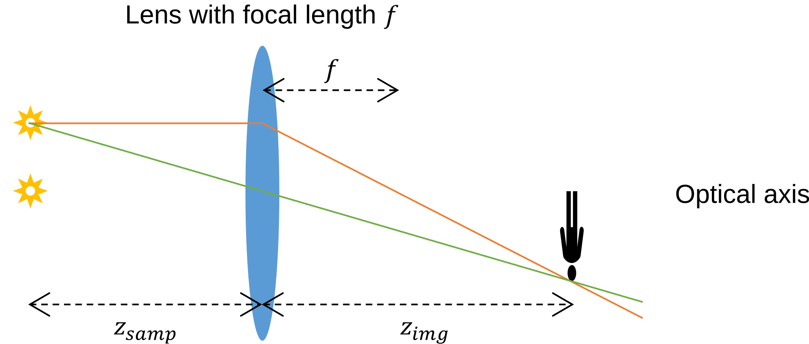

# Ray Optics for Imaging

## 1.1 Light as Straight Ray

Optics explores the characteristics of light and its interactions with matter. It includes several useful descriptions of light, including ray optics, wave optics, and quantum optics. Ray optics is the simplest of these models: it represents light as straight rays that show the direction of propagation. Although this representation is approximate, especially compared with wave and quantum optics, it remains a foundational tool for optical engineering and imaging-system design.

The straight-ray approximation is especially useful for understanding how light is focused by a lens. The main properties of an ideal thin lens are summarized in Figure 1.1:

1. A light ray striking the lens perpendicularly is deflected so that it passes through the lens focal point.
2. A light ray passing through the center of the lens is not deflected.
3. Light propagation is reciprocal: if rays emitted from a source on one side of the lens converge to a point on the other side, then rays emitted from that convergence point and directed back toward the lens retrace the original paths.

**Figure 1.1.** Major properties of an ideal lens.

Consider a rod whose two ends emit diverging light, positioned at a distance $z_\mathrm{samp}$ from an ideal lens. This distance is called the sample distance (Figure 1.2). Among the many rays emitted from the upper end of the rod, one ray that is parallel to the optical axis is deflected through the focal point, located one focal length $f$ from the lens. Another ray passes through the center of the lens and is not deflected. These two characteristic rays converge at a distance $z_\mathrm{img}$, called the image distance. Other rays emitted from the same point on the rod also converge at this location. Similarly, rays emitted from the lower end of the rod converge at the same image distance but at a different transverse position.

If a sheet of paper is placed parallel to the lens at $z_\mathrm{img}$, two focused spots appear at the convergence points. If the rod emits light continuously, like a glow stick, the focused spots form a line image on the paper. Ideally, all rays emitted from any point in the sample plane, located $z_\mathrm{samp}$ from the lens, converge to a corresponding point in the image plane, located $z_\mathrm{img}$ from the lens. These two planes are therefore called **conjugate planes**.

The image distance is governed by the thin-lens equation:

$$
\frac{1}{z_\mathrm{samp}} + \frac{1}{z_\mathrm{img}} = \frac{1}{f}
\tag{1.1}
$$

The magnification is the ratio of the length of the projected image to the length of the original object:

$$
m = \frac{z_\mathrm{img}}{z_\mathrm{samp}}
\tag{1.2}
$$

**Figure 1.2.** Image generated by an ideal thin lens.

### Example 1.1: Simple Single-Lens Camera

Consider a camera with a single thin lens with focal length $f = 100\ \mathrm{mm}$.

1. To capture a focused image of a subject $150\ \mathrm{mm}$ from the lens, determine the required distance between the lens and the camera sensor. Calculate the magnification.
2. To photograph a distant landscape, where the sample distance can be approximated as infinity, determine the required distance between the lens and the camera sensor. Calculate the magnification.
